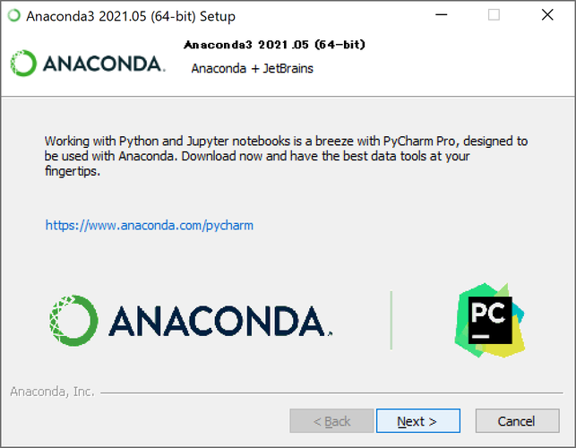
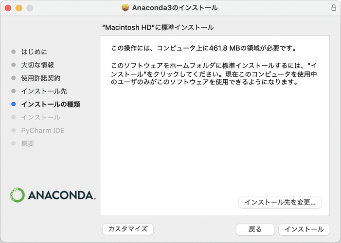

# Pythonを使うための準備

- [はじめに]
- [Anacondaについて]
- [Windowsへのインストール方法]
- [macOSへのインストール方法]

## はじめに

本手順は、書籍『新・標準プログラマーズライブラリ 試してわかる Python［基礎］入門』の読者のための補助資料として公開するものです。
本文では説明できなかったAnacondaのインストール方法について説明しています。

## Anacondaについて

本書はAnacondaと、Anacondaに同梱されたJupyter Notebook上でプログラムを作成することを前提とした説明になっています。
Anacondaにはプログラミング言語Pythonの本体と、Jupyter Notebookなどの関連ツールや機械学習ライブラリなどが同梱されており、これらを一括してインストールすることができます。

本項では、AnacondaのIndividual Editionのインストール手順を解説します。
Anaconda Individual Editionは、Pythonの学習や研究であったり、小規模な研究プロジェクトでの利用など、大規模な商用利用でない限りは無償で使用することができます。
詳細はAnaconda公式ホームページの利用規約などを確認してください。

本項の公開時（2021年11月10日）では、AnacondaでインストールされるPythonのバージョンはPython3.8.8です。
なお、もしPython3.8.8より新しいバージョンのPythonを使っている場合でも、本書のコードは問題なく動作します。

## Windowsへのインストール方法

WindowsでのAnacondaのインストール方法を解説します。
動作確認およびスクリーンショットの撮影はWindows10環境で行っています。

###  Windows用インストーラをダウンロードして起動する

1. 以下のページにアクセスします。

Anaconda │ Individual Edition

<https://www.anaconda.com/products/individual>

2. ページを下にスクロールすると、ダウンロードコーナーが現れます。Windowsの列に表示されている「64-bit Graphical Installer」または「32-bit Graphical Installer」を選択してください。


64bitと32bitのどちらを選択するかは、ご自身のOSに合わせて選択してください。
OSの種類はWindowsの［スタート］ボタン、［設定］、［システム］、［詳細情報］の順に選択し、「デバイスの仕様」の中に表示される「システムの種類」で確認することができます。

3. 次のようなダイアログが表示された場合は、［名前を付けて保存］をクリックしてプログラムをディスクに保存します。


4. ダウンロードが完了すると以下のようなダイアログが表示されるので、［ファイルを開く］をクリックします。


### Anacondaのインストールを開始する

5. インストーラが起動するので、［Next］をクリックします。


6. 使用許諾契約が表示されるので、内容を確認して［I Agree］をクリックします。


7. インストールタイプを指定します。「Just Me」を選択した状態で［Next］をクリックします。


8. インストール先のフォルダを指定します。
初期値のまま［Next］をクリックすると、`C:\Users\ユーザー名\anaconda3`フォルダにインストールされます。
インストール先を変更する場合は［Browse］ボタンをクリックするか、パスを直接入力してください。このときスペースや日本語などのUnicode文字は使用できないので注意してください。


9. インストールオプションを指定します。
1つめのオプションは、Windowsの環境変数`PATH`にAnaconda3のフォルダを追加かするかどうかです。メッセージの最初に「Not recommended.（非推奨）」と書かれているので、チェックはオフのままにしておきます。
2つ目のオプションは、Anaconda3でインストールしたPythonを、システムのデフォルトのPythonとして他のプログラムから利用するかどうかです。
基本的にチェックしたままでかまいませんが、もしすでにAnacondaとは別のPythonをインストールしていたり、今後別の方法でPythonをインストールした場合、この設定が干渉する可能性がありますので注意してください。
オプションを確認できたら、［Install］をクリックします。


10. インストールにはしばらく時間がかかります。画面下部のボタンが利用できるようになったら、［Next］をクリックします。


11. PyCharmに関する情報が表示されるので、［Next］をクリックします。
PyCharmはPythonの統合開発環境ですが、本書では使用しません。



12. ［Finish］をクリックしたら、インストールは完了です。

 

### Pythonのバージョンを確認する

13. Windowsのスタートメニューから「Anaconda3」、「Anaconda Prompt (anaconda3)」を選択します。


14. Anacondaプロンプトが起動します。
Anacondaプロンプトは、PCへの命令をマウスで行うのではなく、キーボードから「コマンド」という命令を入力して実行するアプリです。
行頭に表示されている`>`は、コマンドを入力できることを表す「プロンプト」です。


次のコマンドを入力してください。`python`と`-V`の間には、半角スペースを1つ入力してください。最後にEnterキーを入力すると、Pythonのバージョンが表示されます。

```
python -V
```

なお、インストールする時期によって表示されるバージョン番号は変わります。


15. ウィンドウの［閉じる］ボタンをクリックするか、次のコマンドを実行してAnacondaプロンプトを終了します。

```bat
exit
```

## macOSへのインストール方法

MacでのAnacondaのインストール方法を解説します。
動作確認およびスクリーンショットの撮影はmacOS Big Surで行っています。

###  macOS用インストーラをダウンロードして起動する

1. 以下のページにアクセスします。

Anaconda │ Individual Edition

<https://www.anaconda.com/products/individual>

2. ページを下にスクロールすると、ダウンロードコーナーが現れます。MacOSの列に表示されている「64-bit Graphical Installer」を選択してください。


以下のようなダイアログが表示された場合は、［許可］をクリックしてダウンロードを継続してください。


3. ダウンロードフォルダにインストーラパッケージ（Anaconda3-\*\*\*\*.\*\*-MacOSX-x86_64.pkg）が保存されるので、これをダブルクリックしてください。
ダウンロードする時期によって「\*\*\*\*-\*\*」に表示される数字は変わります。


### Anacondaのインストールを開始する

4. 以下のようなダイアログが表示された場合は、［許可］をクリックします。


5. インストーラが起動するので、［続ける］をクリックします。


6. Anacondaのインストールに関する情報が表示されるので、内容を確認して「続ける」をクリックします。


7. 使用許諾契約が表示されるので、内容を確認して［続ける］をクリックします。


以下のダイアログが表示されるので［同意する］をクリックします。


8. インストール先の選択時に「この場所にはAnaconda3をインストールできません。」というメッセージが表示されることがありますが、「自分専用にインストール」をクリックしてください。


画面下部のボタンが選択できるようになります。［続ける］をクリックしてください。


9. インストール先のフォルダを指定します。
初期値のまま［インストール］をクリックすると、`/Users/ユーザー名/opt/anaconda3`フォルダにAnacondaをインストールします。
インストール先を変更する場合は［インストール先を変更］ボタンをクリックしてください。



10. インストールにはしばらく時間がかかります。画面下部のボタンが利用できるようになったら、［続ける］をクリックします。


途中で以下のダイアログが表示されたときは［OK］をクリックしてください


11. PyCharmに関する情報が表示されるので、［続ける］をクリックします。
PyCharmはPythonの統合開発環境ですが、本書では使用しません。


12. ［閉じる］をクリックしたら、インストールは完了です。


以下のダイアログで［ゴミ箱に入れる］を選択すると、インストーラに使用したパッケージファイルを削除できます。


### Pythonのバージョンを確認する

13. Finderを起動して「アプリケーション」、「ユーティリティ」の順にフォルダを開き、「ターミナル」をダブルクリックします。


14. ターミナルが起動します。
ターミナルは、パソコンへの命令をマウスで行うのでなく、キーボードから「コマンド」という文字列を入力して実行するアプリです。
行頭に表示されている`%`は、コマンドを入力できることを表す「プロンプト」です。


次のコマンドを入力してください。`python`と`-V`の間には、半角スペースを1つ入力してください。最後にReturnキーを入力すると、Pythonのバージョンが表示されます。

```
python -V
```

なお、インストールする時期によって表示されるバージョン番号は変わります。


15. ［ターミナル］メニューから［ターミナルを終了］を選択するか、［command］キーと［Q］キーを同時に押してターミナルを終了します。
