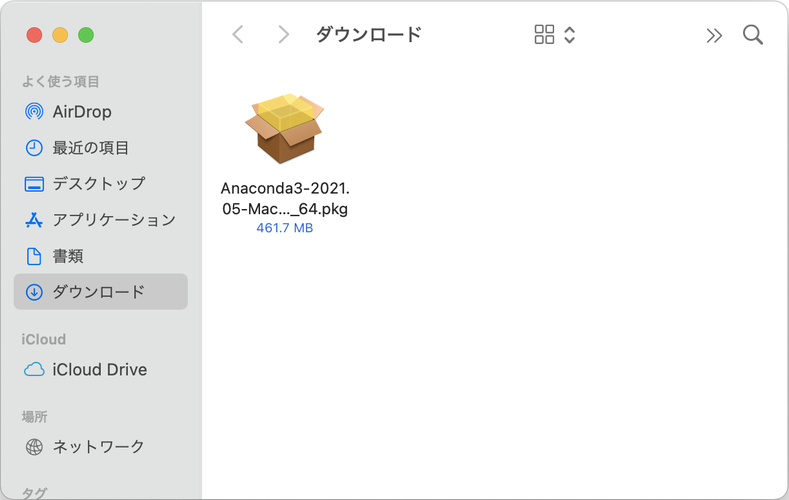
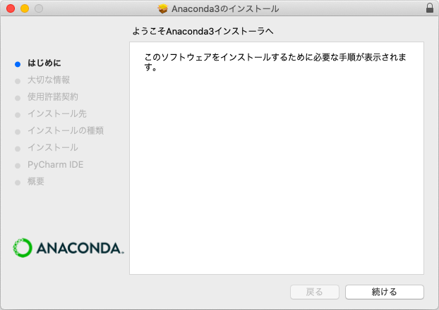
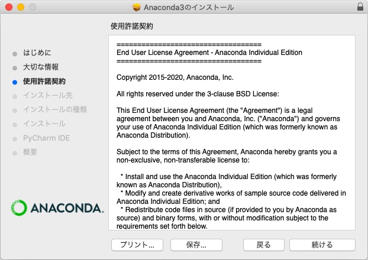
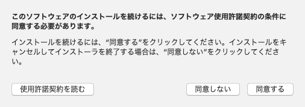
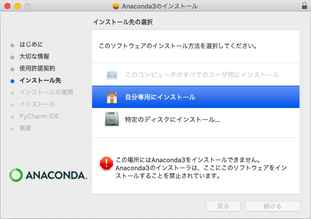
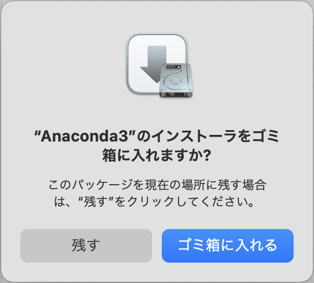
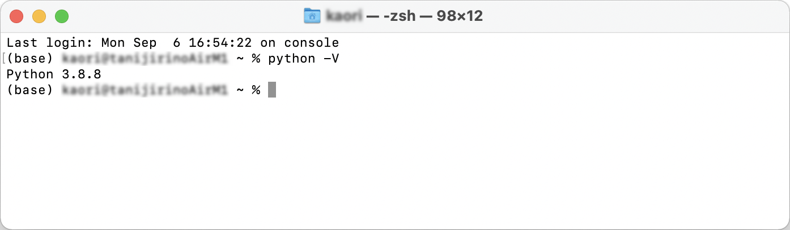

# macOSへのインストール方法

MacでのAnacondaのインストール方法を解説します。
動作確認およびスクリーンショットの撮影はmacOS Big Surで行っています。

##  macOS用インストーラをダウンロードして起動する

1. 以下のページにアクセスします。

Anaconda │ Individual Edition

<https://www.anaconda.com/products/individual>

2. ページを下にスクロールすると、ダウンロードコーナーが現れます。MacOSの列に表示されている「64-bit Graphical Installer」を選択してください。


以下のようなダイアログが表示された場合は、［許可］をクリックしてダウンロードを継続してください。


3. ダウンロードフォルダにインストーラパッケージ（Anaconda3-\*\*\*\*.\*\*-MacOSX-x86_64.pkg）が保存されるので、これをダブルクリックしてください。
ダウンロードする時期によって「\*\*\*\*-\*\*」に表示される数字は変わります。



## Anacondaのインストールを開始する

4. 以下のようなダイアログが表示された場合は、［許可］をクリックします。


5. インストーラが起動するので、［続ける］をクリックします。



6. Anacondaのインストールに関する情報が表示されるので、内容を確認して「続ける」をクリックします。


7. 使用許諾契約が表示されるので、内容を確認して［続ける］をクリックします。



以下のダイアログが表示されるので［同意する］をクリックします。



8. インストール先の選択時に「この場所にはAnaconda3をインストールできません。」というメッセージが表示されることがありますが、「自分専用にインストール」をクリックしてください。



画面下部のボタンが選択できるようになります。［続ける］をクリックしてください。


9. インストール先のフォルダを指定します。
初期値のまま［インストール］をクリックすると、`/Users/ユーザー名/opt/anaconda3`フォルダにAnacondaをインストールします。
インストール先を変更する場合は［インストール先を変更］ボタンをクリックしてください。


10. インストールにはしばらく時間がかかります。画面下部のボタンが利用できるようになったら、［続ける］をクリックします。


途中で以下のダイアログが表示されたときは［OK］をクリックしてください


11. PyCharmに関する情報が表示されるので、［続ける］をクリックします。
PyCharmはPythonの統合開発環境ですが、本書では使用しません。


12. ［閉じる］をクリックしたら、インストールは完了です。


以下のダイアログで［ゴミ箱に入れる］を選択すると、インストーラに使用したパッケージファイルを削除できます。



## Pythonのバージョンを確認する

13. Finderを起動して「アプリケーション」、「ユーティリティ」の順にフォルダを開き、「ターミナル」をダブルクリックします。


14. ターミナルが起動します。
ターミナルは、パソコンへの命令をマウスで行うのでなく、キーボードから「コマンド」という文字列を入力して実行するアプリです。
行頭に表示されている`%`は、コマンドを入力できることを表す「プロンプト」です。


次のコマンドを入力してください。`python`と`-V`の間には、半角スペースを1つ入力してください。最後にReturnキーを入力すると、Pythonのバージョンが表示されます。

```
python -V
```

なお、インストールする時期によって表示されるバージョン番号は変わります。



15. ［ターミナル］メニューから［ターミナルを終了］を選択するか、［command］キーと［Q］キーを同時に押してターミナルを終了します。
