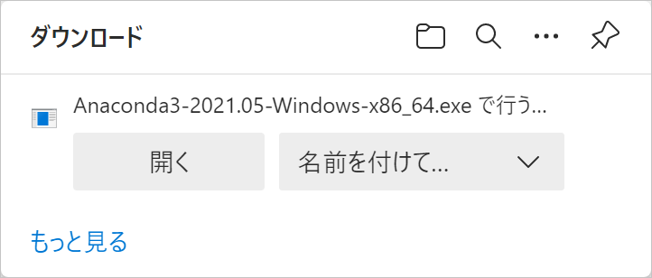
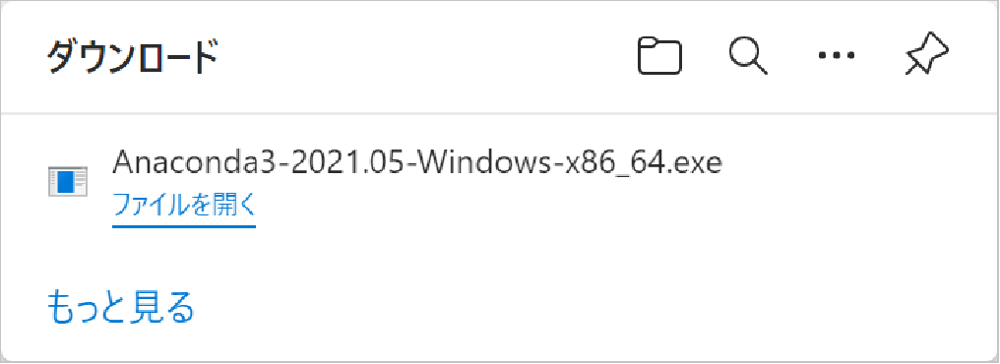
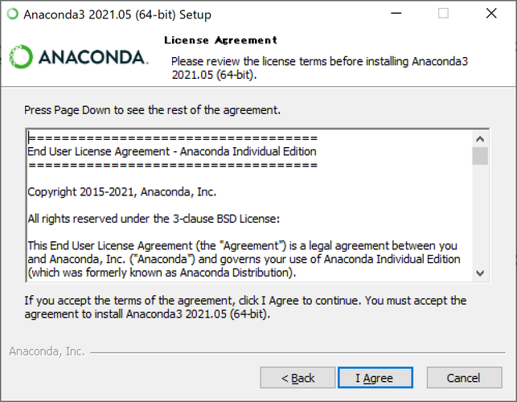
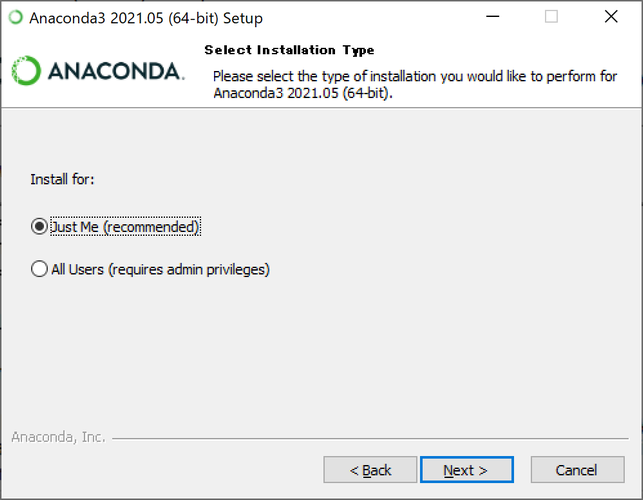
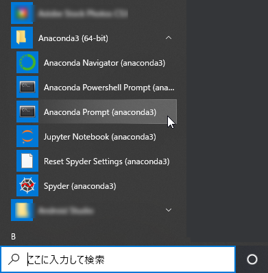
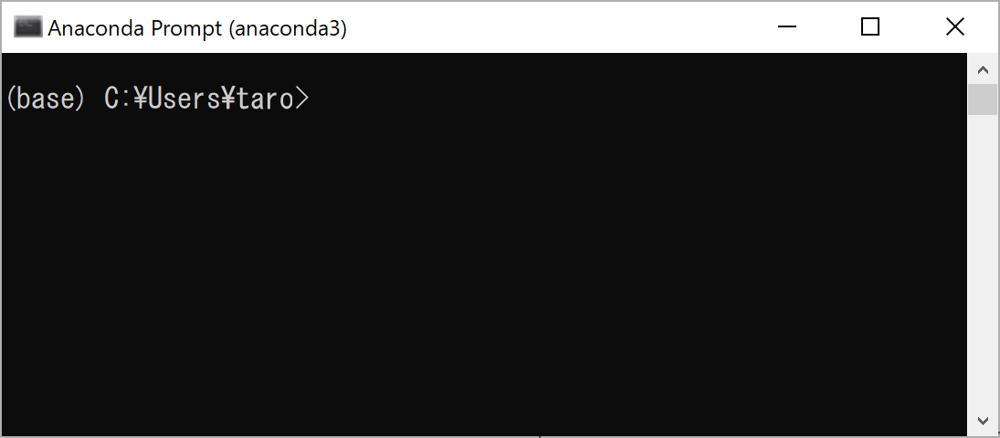
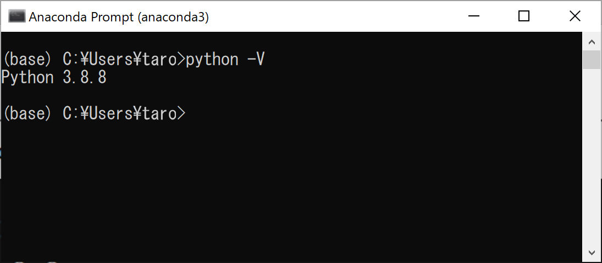

# Windowsへのインストール方法

WindowsでのAnacondaのインストール方法を解説します。
動作確認およびスクリーンショットの撮影はWindows10環境で行っています。

##  Windows用インストーラをダウンロードして起動する

1. 以下のページにアクセスします。

Anaconda │ Individual Edition

<https://www.anaconda.com/products/individual>

2. ページを下にスクロールすると、ダウンロードコーナーが現れます。Windowsの列に表示されている「64-bit Graphical Installer」または「32-bit Graphical Installer」を選択してください。


64bitと32bitのどちらを選択するかは、ご自身のOSに合わせて選択してください。
OSの種類はWindowsの［スタート］ボタン、［設定］、［システム］、［詳細情報］の順に選択し、「デバイスの仕様」の中に表示される「システムの種類」で確認することができます。

3. 次のようなダイアログが表示された場合は、［名前を付けて保存］をクリックしてプログラムをディスクに保存します。



4. ダウンロードが完了すると以下のようなダイアログが表示されるので、［ファイルを開く］をクリックします。



## Anacondaのインストールを開始する

5. インストーラが起動するので、［Next］をクリックします。


6. 使用許諾契約が表示されるので、内容を確認して［I Agree］をクリックします。



7. インストールタイプを指定します。「Just Me」を選択した状態で［Next］をクリックします。



8. インストール先のフォルダを指定します。
初期値のまま［Next］をクリックすると、`C:\Users\ユーザー名\anaconda3`フォルダにインストールされます。
インストール先を変更する場合は［Browse］ボタンをクリックするか、パスを直接入力してください。このときスペースや日本語などのUnicode文字は使用できないので注意してください。


9. インストールオプションを指定します。
1つめのオプションは、Windowsの環境変数`PATH`にAnaconda3のフォルダを追加かするかどうかです。メッセージの最初に「Not recommended.（非推奨）」と書かれているので、チェックはオフのままにしておきます。
2つ目のオプションは、Anaconda3でインストールしたPythonを、システムのデフォルトのPythonとして他のプログラムから利用するかどうかです。
基本的にチェックしたままでかまいませんが、もしすでにAnacondaとは別のPythonをインストールしていたり、今後別の方法でPythonをインストールした場合、この設定が干渉する可能性がありますので注意してください。
オプションを確認できたら、［Install］をクリックします。


10. インストールにはしばらく時間がかかります。画面下部のボタンが利用できるようになったら、［Next］をクリックします。


11. PyCharmに関する情報が表示されるので、［Next］をクリックします。
PyCharmはPythonの統合開発環境ですが、本書では使用しません。


12. ［Finish］をクリックしたら、インストールは完了です。

 

## Pythonのバージョンを確認する

13. Windowsのスタートメニューから「Anaconda3」、「Anaconda Prompt (anaconda3)」を選択します。



14. Anacondaプロンプトが起動します。
Anacondaプロンプトは、PCへの命令をマウスで行うのではなく、キーボードから「コマンド」という命令を入力して実行するアプリです。
行頭に表示されている`>`は、コマンドを入力できることを表す「プロンプト」です。



次のコマンドを入力してください。`python`と`-V`の間には、半角スペースを1つ入力してください。最後にEnterキーを入力すると、Pythonのバージョンが表示されます。

```
python -V
```

なお、インストールする時期によって表示されるバージョン番号は変わります。



15. ウィンドウの［閉じる］ボタンをクリックするか、次のコマンドを実行してAnacondaプロンプトを終了します。

```bat
exit
```

